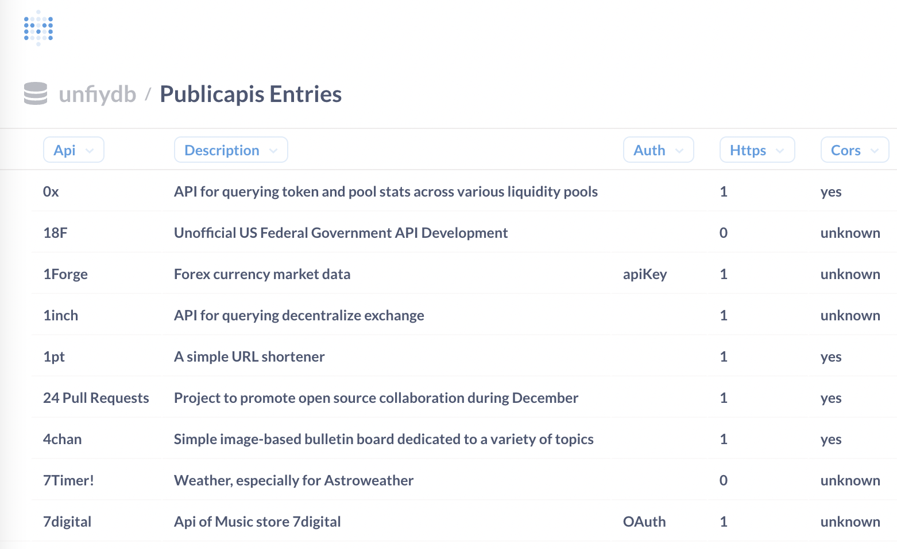

# Unify Tutorial

This tutorial will walk you through the basics of installing **Unify** and working with its core features
for importing and analyzing data.

## Getting started

    pip install unifydb

**Note: Choosing your database backend. **

*Unify supports Clickhouse or DuckDB. DuckDB is "built-in" and 
requires no setup. However, you can't access a DuckDB database from multiple processes easily.
This means if you want to use an analysis tool (like Metabase) on your warehouse, then analysis
has to happen separately from data loading. So Clickhouse is recommended for more flexible setups,
and it's installation is quite easy.*

## Tutorial

Start Unify:

    $ unify
    Welcome to Unify - your personal data warehouse. Use 'help' for help.
    >

Get an overview of available commands:

    > help
    help - show this message
    help schemas - overview of schemas
    ...

Let's start by adding some data to the warehouse. Let's import some CSV data that contains information about electric vehicle sales:

    > import https://data.wa.gov/api/views/f6w7-q2d2/rows.csv?accessType=DOWNLOAD

The data import happens immediately and 10 rows of the resulting table are automatically displayed:

```sql
> import https://data.wa.gov/api/views/f6w7-q2d2/rows.csv?accessType=DOWNLOAD
Loading table...
Saved 114600 rows (17 data columns)
Imported file to table: files.table_rows
10 rows
VIN (1-10)    County         City State  Postal Code  Model Year          Make     Model                  Electric Vehicle Type Clean Alternative Fuel Vehicle (CAFV) Eligibility  Electric Range  Base MSRP  Legislative District  DOL Vehicle ID            Vehicle Location                             Electric Utility  2020 Census Tract
WDC0G5EB7K    Louisa      Bumpass    VA        23024        2019 MERCEDES-BENZ GLC-CLASS Plug-in Hybrid Electric Vehicle (PHEV)             Not eligible due to low battery range              10          0                   NaN       153874850  POINT (-77.73727 37.96459)                                          NaN        51109950101
```
Although 10 records are shown, we imported *114,600* total rows into a new table named `files.table_rows`.

Now let's explore the data a little bit:

    > count files.table_rows
    1 row
        count_
        114600

```sql
> show columns from files.table_rows
17 rows
                                      column_name column_type null  key default  extra
                                       VIN (1-10)     VARCHAR  YES  NaN     NaN    NaN
                                           County     VARCHAR  YES  NaN     NaN    NaN
                                             City     VARCHAR  YES  NaN     NaN    NaN
                                            State     VARCHAR  YES  NaN     NaN    NaN
                                      Postal Code      BIGINT  YES  NaN     NaN    NaN
                                       Model Year      BIGINT  YES  NaN     NaN    NaN
                                             Make     VARCHAR  YES  NaN     NaN    NaN
                                            Model     VARCHAR  YES  NaN     NaN    NaN
                            Electric Vehicle Type     VARCHAR  YES  NaN     NaN    NaN
Clean Alternative Fuel Vehicle (CAFV) Eligibility     VARCHAR  YES  NaN     NaN    NaN
                                   Electric Range      BIGINT  YES  NaN     NaN    NaN
                                        Base MSRP      BIGINT  YES  NaN     NaN    NaN
                             Legislative District      DOUBLE  YES  NaN     NaN    NaN
                                   DOL Vehicle ID      BIGINT  YES  NaN     NaN    NaN
                                 Vehicle Location     VARCHAR  YES  NaN     NaN    NaN
                                 Electric Utility     VARCHAR  YES  NaN     NaN    NaN
                                2020 Census Tract      BIGINT  YES  NaN     NaN    NaN
```
The `import` command has loaded our CSV into a new table. It places the table under the `files`
schema because the FileConnector was used to load the data.

The column names and types were inferred from the data in the CSV file. We can use any SQL to analyze
the data:

```sql
> select distinct(Make) from files.table_rows
34 rows
          Make
 MERCEDES-BENZ
         TESLA
          FORD
        NISSAN
          AUDI
           KIA
...
> select count(*) as count, Make from files.table_rows group by 2 order by count desc
34 rows
 count           Make
 52674          TESLA
 12839         NISSAN
 10273      CHEVROLET
  6072           FORD
  4756            BMW
  4561            KIA
  4445         TOYOTA
  2719     VOLKSWAGEN
```
In our data set Tesla and Nissan sold the most electric vehicles.

## Creating connections

The `files` connector is automatically configured, but now lets connect to a real API and load some more 
interesting data. Unify comes with a set of **connectors** for pulling table from different systems.

The site [Public APIs](https://publicapis.dev/) publishes a simple API which returns their curated list
of publicly usable system APIs.  

We have created a simple connector for querying from this API. To use it, you first need to create
a **connection**, which configures the connector in your environment and binds it to a `schema` in your
database:

```sql
> connect
1: aws_costs
2: coda
3: datadog
4: publicapis
...
```
Choose the `publicapis` connector and finish the setup:
```
Pick an connector: 4
Ok! Let's setup a new publicapis connection.
Specify the schema name (publicapis):
Please provide the configuration parameters:
Testing connection...
New publicapis connection created in schema 'publicapis'
The following tables are available, use peek or select to load data:
1 row
table_name table_schema comment materialized
 entries     publicapis    None            ☐
>
```

Because this connector is so simple, there is no additional configuration other than specifying the connector. 
But for most connectors you will need to provide at least authentication credentials.

Once the connection is created, then the schema will be created in your database, but it will be empty:

```sql
> show schemas
files
publicapis
```
However, if you use `show tables` you will see the **available** tables from the connector:
```sql
> show tables from publicapis
table_name table_schema comment materialized
 entries     publicapis    None            ☐
```
The *materialized* column shows that the `entries` table is available but no data has been loaded.
If we `select` from the table then it will automatically load the data from the API:

```sql
> select * from publicapis.entries
Loading table...
    API                                        Description          Auth  HTTPS    
    0x API for querying token and pool stats across va...                    1   
    18F   Unofficial US Federal Government API Development                   0 
    1Forge                      Forex currency market data        apiKey     1 
...
```
and now we can inspect the table loaded with data from the API:
```sql
> show columns from publicapis.entries
7 rows
column_name column_type default_type default_expression comment codec_expression ttl_expression
        API      String                                                                        
       Auth      String                                                                        
   Category      String                                                                        
       Cors      String                                                                        
Description      String                                                                        
      HTTPS       UInt8                                                                        
       Link      String                                                                        

> select * from publicapis.entries where API ilike '%JIRA%'
1 row
 API                                        Description  Auth                                  Link                 Category
JIRA JIRA is a proprietary issue tracking product th... OAuth      1 unknown https://developer.atlassian.com/server/jira/pla... Documents & Productivity
```
```sql
> select count(*) as count, Auth from publicapis.entries group by Auth order by count desc
5 rows
 count          Auth
   669              
   600        apiKey
   149         OAuth
     6 X-Mashape-Key
     1    User-Agent
>
```
Once we create a query with some interesting results we can work with it easily.
We can *export the table* to a file (or Google Sheet if we create a GSheets connection):
```sql
> export publicapis.entries to files 'api_entries.csv'
> show files
api_entries.csv
```
Or we can *email the data* to ourselves (this requires SMTP config):
```sql
> email publicapis.entries to 'scottpersinger@gmail.com'
Sent data to scottpersinger@gmail.com
```
Or we can even draw our data as a chart:
```sql
> create chart as bar_chart where x = Auth and y = count
```
To help keep our results straight, we can use *variables* to remember the results of queries:
```sql
> $ecars = select count(*) as count, Make from files.table_rows group by 2 order by count desc
```
and then refer to them later:
```sql
> create chart from $ecars as bar_chart where x = Make and y = count
```

### Graphical analysis

Unify has only primitive built-in charting features. But you can connect lots of popular Business Intelligence tools to the database.

The easiest way to start is to use [Metabase](https://www.metabase.com/) - a popular open source
BI tool.

Unify makes it super easy to try it out:
```sql
> open metabase
Do you want to install and run Metabase (y/n)? y
Downloading Metabase
 100.0% [======================================================================================================================>] 265267/265266 eta [00:00]
Downloading Clickhouse driver
 100.1% [==========================================================================================================================>] 1318/1317 eta [00:00]
Please enter info to create your local Metabase account:
Enter your email address: scottp@example.com
Choose a Metabase login password: *****
Confirm the password: *****
Metabase setup succeeded
```
**Exploring your warehouse in Metabase**



## Learning more


